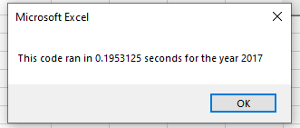
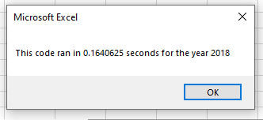

# Stock Market VBA Analysis

## Overview of Project

### Purpose
A continuation on our analysis of Stock Market Data to help Steve provide sound financial advice. At this point in the process Steve is seeking to enhance our previous code in VBA to allow it to process the entire stock market instead of a subset of securities. To do this our goal is to use the refactor technique which should make our code more efficient by taking fewer steps and improving its logic, which then should speed up the executing process and increase the amount of data that can be processed.  

## Results

### Analysis on Stocks and VBA Script
To complete our stock analysis for Steve there were two key values we calculated from the dataset which were their total daily volume of shares traded over the course of the year and each stock's yearly return to measure its performance for the given year. As shown in the code below we programed this to determine each security's starting price for the year along with its closing price then to perform the calculation and provide the output as the year's return. From reviewing the stock performance over 2017 and 2018, this was critical information for our recommendation. From reviewing 2017 alone most of our subset would seem to be solid recommendations as only one security had a negative return (TERP). From reviewing 2018's data though, the recommendation would provide clear clarity that the only securities which followed up 2017 with another strong positive year were ENPH and RUN. In terms of the results for our VBA script after refactoring, this showed to be a total success. While the execution time for the original script took around .85 of a second to complete, the refactored script takes less than a quarter of this to generate the same data at around .18 seconds. 

### Code
```

```

## Summary

### Refactoring Code in General
Overall there are many advantages on the refactoring technique when working with code. The main goal is to make existing code become more efficient and this can have mulitple beneficial outcomes, including speeding up the time that it takes the existing process to complete its task. By making the process faster it allows the system to process a larger dataset and increases the volume of information we are able to obtain. Other benefits are also that it can reduce the amount of steps needed within the program which can help make the process quicker to understand, and this is useful for other people when they review the code at a later time. While the refactoring process has its advantages, there are also disadvantages. It can be a time consuming technique trying to make a working process more efficient and especially when working with numerous variables. Unlike trying to obtain an output as the sole achievement, the purpose here is to become more efficient and if the refactoring results aren't better than the orginial work then the time could have been spent better elsewhere. Another disadvantage is ideally the programmer is an expert on the code that is being worked with in order to fully understand the design behind each part of code. 

### Refactored VBA Script
In terms of our VBA script there is a clear advantage for the refactored script in this scenario. The screenshots below show that it takes to execute the program is now under a quarter of the time it took to complete the same output before we completed refactoring the code. This will allow Steve to increase the volume of securities in the datasheet for both years and the programs have been coded so they can be easily adjusted to process this information at an efficient speed. 



